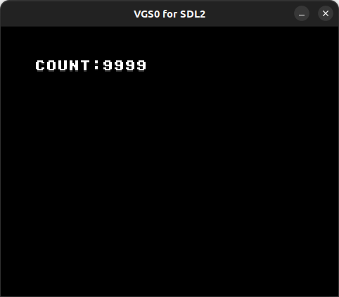

# Global Variables

- グローバル変数の利用例です



## How to build

### Pre-request

- GNU make and GNU Compiler Collection
  - macOS: install XCODE
  - Linux: `sudo apt install build-essential`
- SDCC
  - macOS: `brew install sdcc`
  - Linux: `sudo apt-get install sdcc`

### Build

```zsh
git clone https://github.com/suzukiplan/vgszero
cd vgszero/example/02_global
make
```

## ROM structure

```
8KB x 3 banks = 24KB ROM
```

- Bank 0: program
- Bank 1: program
- Bank 2: font.chr

## Program Code

### global.h

```c
#pragma once
#include "../../lib/sdcc/vgs0lib.h"

struct GlobalVariables {
    uint8_t c1;
    uint8_t c10;
    uint8_t c100;
    uint8_t c1000;
    uint8_t stop;
};

#define GV ((struct GlobalVariables*)0xC000)
```

### program.c

```c
#include "../../lib/sdcc/vgs0lib.h"
#include "global.h"

void countUp(void)
{
    if (!GV->stop) {
        GV->c1++;
        if (9 < GV->c1) {
            GV->c1 = 0;
            GV->c10++;
            if (9 < GV->c10) {
                GV->c10 = 0;
                GV->c100++;
                if (9 < GV->c100) {
                    GV->c100 = 0;
                    GV->c1000++;
                    if (9 < GV->c1000) {
                        GV->stop = 1;
                        GV->c1 = 9;
                        GV->c10 = 9;
                        GV->c100 = 9;
                        GV->c1000 = 9;
                    }
                }
            }
        }
    }
}

void main(void)
{
    // パレットを初期化
    vgs0_palette_set(0, 0, 0, 0, 0);    // black
    vgs0_palette_set(0, 1, 7, 7, 7);    // dark gray
    vgs0_palette_set(0, 2, 24, 24, 24); // light gray
    vgs0_palette_set(0, 3, 31, 31, 31); // white

    // Bank 2 を Character Pattern Table ($A000) に転送 (DMA)
    vgs0_dma(2);

    // グローバル変数を初期化
    GV->stop = 0;
    GV->c1 = 4;
    GV->c10 = 3;
    GV->c100 = 2;
    GV->c1000 = 1;
    vgs0_bg_putstr(4, 4, 0x80, "COUNT:");

    // メインループ
    while (1) {
        vgs0_wait_vsync();
        countUp();
        VGS0_ADDR_BG->ptn[4][10] = '0' + GV->c1000;
        VGS0_ADDR_BG->ptn[4][11] = '0' + GV->c100;
        VGS0_ADDR_BG->ptn[4][12] = '0' + GV->c10;
        VGS0_ADDR_BG->ptn[4][13] = '0' + GV->c1;
    }
}
```

### Explanation

- VGS0 の RAM 先頭アドレス（0xC000）をポイントする構造体でグローバル変数を管理する事を推奨します。
- グローバル変数サイズが大きくなりすぎるとスタックとの競合の恐れがあるため、最大でも 8KB 以内とすることを推奨します。
